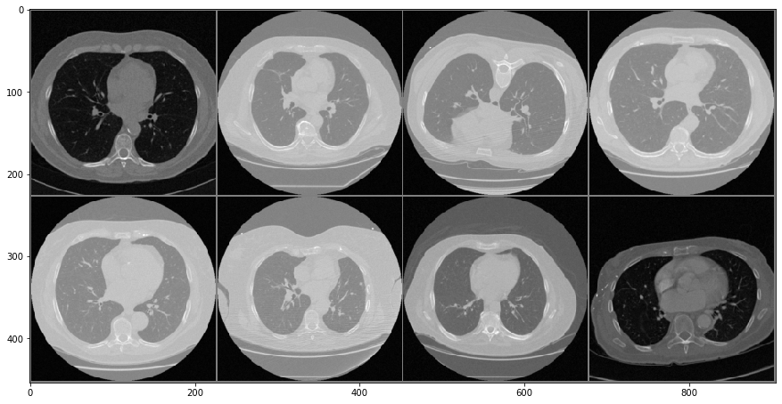
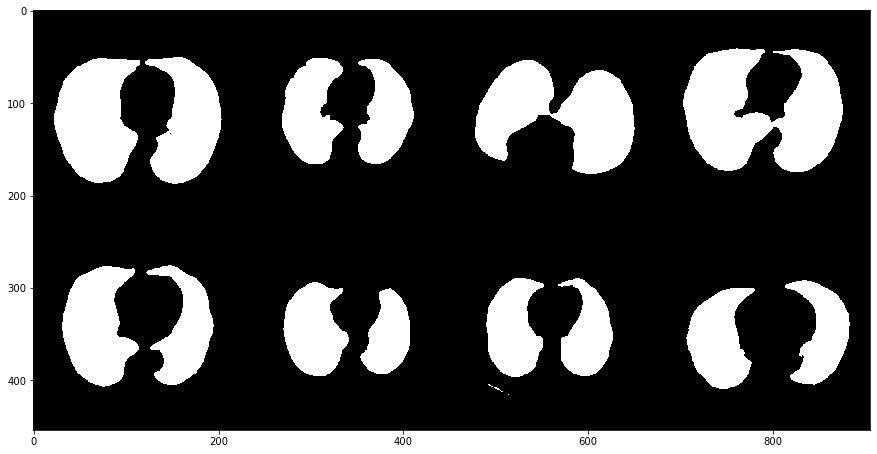

# CT-Segmantation
Pytorch implementation of Lung CT image segmentation Using U-net

**Figure 1: Original CT images**

**Figure 2: Ground-truth Segmentation Mask**

**Figure 3: Predicted Segmentation Mask**

## Requirement
jupyter
numpy
opencv-python
Pillow
torch
torchvision
tqdm

    pip install -r requirements.txt
## Dataset
1. Download the data from [Kaggle/Finding and Measuring Lungs in CT Data](https://www.kaggle.com/kmader/finding-lungs-in-ct-data)
2. With totally 267 CT slices, I randomly select 200 slices for training and 67 for testing